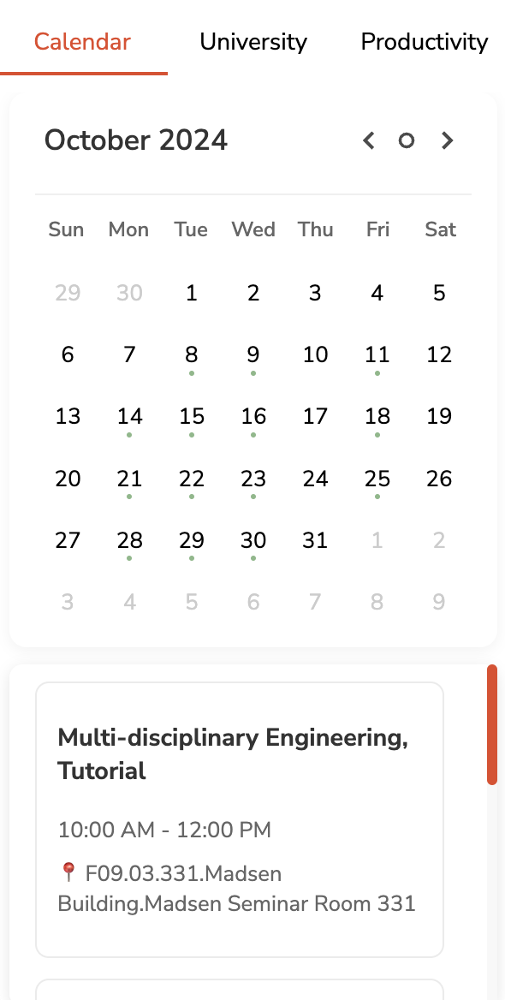

# USync: Chrome Extension for the University of Sydney  

**"Your Campus, Your Connection, All in One Place!"**

USync is a feature-rich Chrome extension designed to enhance your university experience. From managing timetables to exploring food options, tracking library occupancy, and staying productive, USync helps you stay connected to the University of Sydney.

  

## 🚀 Features  

### 1. **Calendar**  
- View your university timetable in an interactive calendar format.  
- Subscribe to your university calendar for automatic updates.  

### 2. **University**  
#### a. **Events**  
- Discover current university events, clubs organizing them, locations, times, and more.  

#### b. **Library**  
- See all campus libraries and their operational status.  
- Check facilities within each library to determine availability.  
- View occupancy details for Fisher and Law libraries (e.g., Occupied: 46 (7.12%)) to plan your visits.  

#### c. **Food**  
- Explore food places on campus, filtered by location.  
- Check whether specific food places are open or closed.  
- View menus, prices, and availability for certain locations.  

### 3. **Productivity**  
- **Pomodoro Timer**: Default to 25 minutes but fully customizable for any task.  
- **To-Do List**: Organize tasks to stay focused and boost productivity.  

### 🔐 **Privacy First**  
USync operates without a traditional backend. No personal data is stored; all information is fetched directly from the university.  

## 🎥 Video Demo

[

## 🔧 Installation  

### Option 1: Install from the Chrome Web Store (Recommended)  
1. Visit the [USync Chrome Web Store page](https://chromewebstore.google.com/detail/usync/cllffmandgbmnabfdaakajjpmlfmibpj).  
2. Click **Add to Chrome**.  
3. Confirm the installation and pin the USync extension to your toolbar for easy access!  

### Option 2: Manual Installation  
1. Clone this repository or download the ZIP file.  
2. Open Chrome and navigate to `chrome://extensions`.  
3. Enable **Developer Mode** (toggle in the top-right corner).  
4. Click **Load Unpacked** and select the project folder.  
5. Pin the USync extension to your toolbar for easy access!  

## 🤝 Contributing  

We welcome contributions to make uSync even better!  

### How to Contribute:  
1. **Fork the repository**: Clone it to your local machine.  
2. **Make changes**: Add new features, fix bugs, or improve documentation.  
3. **Submit a Pull Request (PR)**: Describe your changes in detail.  

### Current Features in Development:  
- [ ] Expanding events to include all university-wide activities (not just USU).  
- [ ] A more robust calendar that allows subscriptions to Google or Apple Calendar.  
- [ ] Adding the ability for users to create and add custom events.  
- [ ] Completing menus and adding data for all campus food places.

## 👨‍💻 About the Author  

**Srijan Chaudhary**  
Second-year Bachelor of Engineering Honours (Software Engineering) student at the University of Sydney.  

Passionate about creating tools that simplify and enhance the student experience. USync is a personal project designed to bridge the gap between students and their campus, making university life more organized and efficient.  

Feel free to reach out for collaboration or feedback!  

